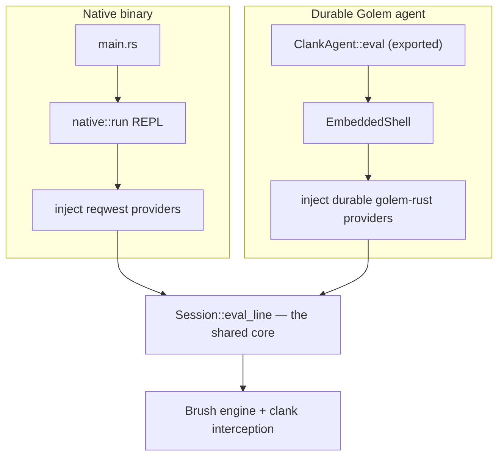

# clank — how it works (contributor onboarding)

For someone who knows Rust but not this project. This explains how clank actually runs — the
execution flow, the data path, and the one design decision that explains most of the code. It
describes; it does not judge. (For a production-readiness review with severity rankings, see
[`docs/audit/`](audit/).)

Written against `main-rc-1`. Coverage and open questions are at the end — read them to know how far
to trust the rest.

---

## 1. Orientation

clank is an **agent-native shell**. You type bash-compatible command lines; it runs them. Two things
make it more than a shell wrapper:

- It runs the same shell **two ways from one codebase**: as an ordinary native binary, and as a
  **durable Golem WebAssembly agent** — a shell instance whose entire state (working directory,
  environment, command transcript, installed packages) persists across invocations and survives
  crashes, because Golem records every operation to a replayable log.
- It has **AI and package-management woven into the shell surface**: `ask` runs an agentic LLM loop
  that can call shell commands as tools; `grease` installs prompts, scripts, skills, MCP servers, and
  other Golem agents as first-class commands; `mcp` speaks the Model Context Protocol.

**The controlling design decision — read this and half the code stops being surprising.** There is
*one* shell core, [`Session`](../crates/clank-shell/src/session/mod.rs), and it is **target-agnostic**.
Everything that differs between native and the durable agent is either a `#[cfg]` branch or an
**injected provider** — a boxed trait object the two entry points install differently. Native injects
`reqwest`-backed providers; the agent injects durable `golem-rust`-backed ones. When a provider is
absent (native with no API key, or an agent with no cluster), the feature degrades to an honest
"not configured" error rather than crashing. clank is native-first by intent; durability is the perk
the wasm target adds, not a second implementation.

**What it is not:** it is not a reimplementation of bash. The actual shell engine — parsing,
expansion, pipelines, job control — is [Brush](https://github.com/reubeno/brush), a Rust shell,
pulled in as a dependency (a patched fork). clank wraps Brush; it does not replace it. And it is not
multi-user: `sudo` means "the human authorized this," not Unix uid 0.

---

## 2. The workspace at a glance

| Crate | What it is | Target |
|---|---|---|
| **`clank-shell`** | The whole shell core (~28k LOC): `Session`, the AI/MCP/grease/golem subsystems, coreutils, authz, logging. `cdylib`+`rlib`+bin. | both |
| **`clank-agent`** | clank's own Golem agent type — ~60 lines that wire the shell surface to the full provider set. | wasm |
| **`clank-embed`** | The shell surface *as a reusable library*: `EmbeddedShell` + the wasm HTTP providers. Any Golem agent can embed it. | wasm |
| **`greeter-agent`** | A trivial second agent that proves the shell surface is a contract, not a clank-only feature. | wasm |
| **`whttp`** | The shared HTTP transport — one `cfg`-gated client (`wstd` on wasm, `reqwest` on native) plus target-agnostic redirect/timeout handling. | both |
| **`wcurl` / `waget`** | `curl` / `wget` clones over `whttp`. | both |
| **`clank-conformance`** | One `.clank` test corpus run against two backends (native `Session` and a live Golem agent). | both |
| **`grease-tool`** | A dev tool that authors + serves a signed grease registry. | native |
| **`golem-stuff/golem`** | A vendored clone of the Golem SDK, path-depended (not part of clank's own workspace). | — |

Inside `clank-shell/src`, the code is grouped by concern: `session/` (the core, split across several
files), `ai/` (ask + LLM), `mcp/`, `grease/`, `golem/` (cluster + agent RPC), `tools/` (coreutils
wrappers), `builtins/` (clank's own builtins like `kill`, `secretenv`), `runtime/` (proc table,
secret slot, procfs), plus top-level `authz.rs`, `manifest.rs`, `registry.rs`, `logging.rs`,
`native.rs` (the native REPL), and `lib.rs` (the `Transcript` + wasm entry).

---

## 3. Cast of characters

The names the rest of this document spends. `Session` owns almost all of them.

| Name | What it is | Where |
|---|---|---|
| `Session` | The shell core. Owns the engine, transcript, registries, proc table, secret set, and every injected provider. | `session/mod.rs` |
| `Shell` (`shell`) | The Brush engine instance — does the actual parsing and execution. | (Brush dep) |
| `Transcript` | The AI context window: recent command+output entries, with an `Elided` marker + summary buffer for compacted history. | `lib.rs` |
| `Manifest` | Per-command metadata: `authorization_policy`, `execution_scope`, subcommands, param specs. | `manifest.rs` |
| `CommandRegistry` | name → `Manifest`, for clank's built-in commands. | `registry.rs` |
| `ProcessTable` | One synthetic row (PID, state R/S/Z/P) per executed line; what `ps` reads. | `runtime/proctable.rs` |
| `Pending` | An outstanding question (a `prompt-user` or an authz confirmation) the session is parked on. | `session/mod.rs` |
| `AskProvider` / `McpHttp` / `AgentInvoker` / `GolemCluster` | The four injected provider seams — `None` until an entry point installs them. | `ai/`, `mcp/`, `golem/` |
| `LineResult` / `EvalResult` | The structured outcome of one line: stdout, stderr, exit code, flow, `pending_prompt`. `EvalResult` is the wire form the agent returns. | `session/mod.rs`, `clank-embed` |
| `GreaseState` / `McpState` | Installed packages / MCP servers, reconstructed deterministically on agent boot. | `grease/state.rs`, `mcp/state.rs` |
| `EmbeddedShell` | The lazily-built `Session` wrapper a Golem agent embeds. | `clank-embed/src/shell.rs` |

The single most useful fact about `Session`: several of its fields are `Arc<Mutex<…>>`
(`transcript`, `proc_table`) **not because of threads**, but because Brush builtins like `ps` and
`context` cannot reach `Session` directly. `Session` installs those shared handles into thread-local
/ process-global slots for the duration of one line, and the builtins read them from there. When you
see the `Arc<Mutex>`, think "a Brush builtin needs to see this," not "concurrency."

---

## 4. The spine — what happens when you evaluate a line

One continuous walk, in the order things actually happen. This is the native path; the agent path is
identical from step 2 on (§6 covers how it gets here). The entry is
[`Session::eval_line`](../crates/clank-shell/src/session/mod.rs) → `eval_line_inner`.

**Stage 0 — the driver reads a line.** Native: `main.rs` → [`native::run`](../crates/clank-shell/src/native.rs)
is a classic read/eval/print loop over blocking `std::io`. It handles `ask repl` and PS2 continuation
(typing a multi-line heredoc) itself, because it owns the terminal, then calls `eval_line`.

**Stage 1 — logging brackets the line.** `eval_line` installs the session's log sink, emits a `start`
event to `shell.log`, runs the inner logic, then emits the outcome. Every log line first passes
through a central secret filter, and the command line itself is redacted before logging (an
`export --secret` value or a `--key`/`--token` argument never reaches the log).

**Stage 2 — is a question already outstanding?** If `self.pending` is `Some`, the shell is parked on a
prompt and refuses to run a new command — it re-surfaces the question. The one exception is
`kill <pid>` targeting the parked row, which aborts it. This is the crux of clank's **non-blocking
prompt model** (§5, §7): the shell never blocks waiting for a human; it returns and expects the
caller to notice `pending_prompt` and answer via `answer_prompt`.

**Stage 3 — install per-line state.** The secret-env set goes in *first* (so the transcript recorder
and `env`/`ps`/`/proc` mask secrets for this whole line), then the line is recorded into the
transcript, finished background jobs are reaped (their rows flip `S → Z`), and the proc-table and
transcript handles are installed into their slots. A capability cache (dynamic manifests, the
`/mnt/mcp` resource index, the live system prompt) is rebuilt only if an MCP server or grease package
was installed/removed since last time.

**Stage 4 — pipeline head-split and pipe pre-extraction.** A `curl … | jq` line is split so the curl
head is handled by clank and the rest by Brush. A `cat x | ask "…"` line has its upstream stdout
pre-extracted into `next_ask_stdin`, because `ask` cannot run *inside* a Brush pipeline (see the
boundary note on Wall C in §5).

**Stage 5 — the authorization gate.** *Before* the line reaches Brush, clank splits it into top-level
segments and resolves each segment's command against its `Manifest`. The line is gated on the
**strictest** segment: `allow` runs, `confirm` / `sudo-only` surface a confirmation prompt (the same
`Pending` machinery as `prompt-user`). This gate lives here, pre-Brush, for a concrete reason:
**Brush's extension API offers no per-command dispatch hook**, so clank cannot intercept execution
*inside* Brush — the clank layer is the only enforcement point. (`authz.rs`.)

**Stage 6 — interception vs. Brush.** clank classifies the line. If it is one of clank's own commands
— `ask`, `grease`, `mcp`, `golem`, a coreutils tool, `curl`/`wget` — clank runs it directly (these
are the subsystems in §8). Otherwise the line goes to the Brush engine, which does the real parsing,
expansion, and execution. Intercepted or not, output is captured, the transcript and proc row are
updated, and a `LineResult` comes back.

**Stage 7 — the result surfaces.** `eval_line` logs the outcome and returns the `LineResult`. Native
prints it; the agent serializes it to an `EvalResult` record. If the line parked on a question,
`pending_prompt` is set and the driver routes the next input to `answer_prompt`.

---

## 5. The two worlds: native vs. the durable agent

This is clank's defining complexity, so it gets its own section.

Both worlds run the exact same `Session::eval_line`. They differ only at the edges:



**How each world injects providers.** Native: [`native::inject_native_providers`](../crates/clank-shell/src/native.rs)
installs `reqwest`/`rustls` shims for the LLM, MCP HTTP, and (if a cluster is configured) Golem. The
agent: `ClankAgent::new` builds an `EmbeddedShell::with_default_golem_providers()`, whose `Session`
gets durable `wstd`/`golem-rust` implementations. Same four `Option<Box<dyn …>>` fields on `Session`;
different boxes.

**What "durable" buys and demands.** On Golem, `ClankAgent::eval` is an *exported component function*.
Golem records each invocation to an **oplog** and can replay it to reconstruct state after a crash —
so `Session` state must be **deterministic under replay**. This is why the proc table, background
jobs, and MCP/grease state are all described as "reconstructed from replayed history": they are
rebuilt by re-running the recorded lines, not restored from a snapshot. It is also why filesystem
writes use whole-file rewrites rather than appends — an append replays as a *second* append and
duplicates data, whereas a whole-file write is idempotent.

> **Boundary — the component export.** When `eval` returns, the invocation is done and the instance
> may be parked. Anything spawned but not awaited before returning simply never runs. And a panic
> that escapes the export **traps** the instance rather than returning an error — which is why
> reachable panics are treated as durable-instance hazards (noted in the audit).

> **Boundary — per-agent serialization (Wall C).** Golem serializes invocations per agent instance: a
> parked agent cannot receive a concurrent call. This single fact shapes two designs. (1) The
> **non-blocking prompt model** — the shell can't block for human input, because a blocked invocation
> would make the agent unreachable, so it returns and waits to be called again. (2) On wasm there is
> no OS pipe and no thread pool, so pipelines and `$( )` use an in-memory stream with inline-
> sequential execution (the producer finishes and drops its writer, giving the reader a clean EOF).
> The visible consequence: `ask` and `context summarize` can't run *inside* a pipeline — one
> Session-layer stage per line — which is why `cat x | ask` is handled by pre-extraction (Stage 4),
> not as a real pipe.

---

## 6. How a line reaches `Session` on the agent

The agent surface is deliberately tiny —
[`ClankAgent`](../crates/clank-agent/src/clank_agent.rs) is three methods:

- `eval(cmd) -> EvalResult` — run one line.
- `answer_prompt(response) -> EvalResult` — deliver a human answer to an outstanding question.
- `abort_prompt() -> EvalResult` — cancel it (the Ctrl-C convention, exit 130).

`new(name)` makes the agent identity: distinct names are fully isolated instances (separate state,
transcript, filesystem). All three methods delegate to `EmbeddedShell`
([`clank-embed/src/shell.rs`](../crates/clank-embed/src/shell.rs)), which lazily builds the `Session`
on first `eval` (because `Session::new` is async but the Golem constructor is sync) and maps
`LineResult → EvalResult`. `greeter-agent` embeds the *same* surface with a minimal provider set — it
exists to prove `EmbeddedShell` is a reusable contract, not clank-private.

---

## 7. Four subsystems the spine passes through

Brief tours of the interception targets from Stage 6. Follow the anchors when you need depth.

**`ask` — the agentic LLM loop** ([`session/ask.rs`](../crates/clank-shell/src/session/ask.rs),
[`ai/ask.rs`](../crates/clank-shell/src/ai/ask.rs)). `ask "question"` assembles the transcript as
context and drives model turns through the injected `AskProvider`. The model can call two tools:
`shell` (run a command) and `prompt_user` (ask the human). Each `shell` tool call is **re-gated**
through the same authz machinery *and* a scope gate (only subprocess-safe commands may be tool-called;
command substitution is refused on this path) — because the tool runs on the *shared* `Session`, so an
un-gated tool call would mutate the real shell. When the model calls `prompt_user`, the loop **parks**
on a `Pending` and returns; the human answers via `answer_prompt`, which resumes the loop mid-flight.
This durable mid-loop pause is only possible because of the non-blocking prompt model.

**`grease` — the package manager** ([`session/grease.rs`](../crates/clank-shell/src/session/grease.rs),
[`grease/pkg.rs`](../crates/clank-shell/src/grease/pkg.rs)). `grease install <name>` fetches a package
from a registry and installs it as one of five kinds: a **prompt** (becomes an `ask` command), a
**script** (shell source run as a synthetic process), a **skill** (context + `$PATH` scripts), an
**mcp** server, or an **agent** (a Golem agent invoked over RPC). Integrity is layered and
fail-closed: the content is checked against the registry's advertised sha256; a signed registry's
packages must carry a valid ed25519 signature; and an RFC-6962 transparency-log inclusion proof is
verified when present. `pkg.rs` hand-rolls the sha256/ed25519/Merkle verification on `sha2` +
`ed25519-dalek`, with real tamper tests.

**coreutils — the fd-swap** ([`tools/coreutils.rs`](../crates/clank-shell/src/tools/coreutils.rs)).
`ls`, `cat`, `grep`, `sed`, etc. are the real [uutils](https://github.com/uutils/coreutils) crates,
not reimplementations. Because uutils writes to the process's standard fds, clank temporarily
**rebinds fds 0/1/2** around each call — via `libc::dup2` on native, and `__wasilibc_fd_renumber` on
wasm — so the tool's output lands in Brush's capture files instead of the real terminal.

> **Boundary — fd manipulation.** This is the one place clank uses `unsafe`. The fds are saved,
> swapped to the redirect/capture targets, the tool runs, and the originals are restored on every
> path including panics. Each block carries a `// SAFETY:` note.

**authz + manifests** ([`authz.rs`](../crates/clank-shell/src/authz.rs),
[`manifest.rs`](../crates/clank-shell/src/manifest.rs)). A `Manifest` gives each command an
`authorization_policy` (`allow`/`confirm`/`sudo-only`, enforced at Stage 5) and an `execution_scope`
(whether it's safe to run as an `ask` tool). `sudo` is human intent, not credentials: a leading
`sudo` marks the invocation elevated and is stripped before the command runs.

---

## 8. The failure path

Where things go wrong, walked with the same care as the happy path — often the half you actually
need.

- **A missing provider degrades, it doesn't crash.** `ask` with no `AskProvider`, MCP with no
  `McpHttp`, a `golem` command with no cluster — each returns a clean "not configured / needs a
  cluster" error (exit 4). This is deliberate: the same binary runs everywhere and tells you honestly
  what isn't wired up, rather than panicking.
- **An outstanding prompt blocks new commands.** If you (or a client) try to run a command while a
  `prompt-user` question is pending, the session refuses and re-surfaces the question (Stage 2). A
  client that ignored `pending_prompt` and moved on would otherwise wedge the session on a question it
  has forgotten — so clank makes forgetting impossible.
- **A panic on the agent traps the instance.** Unlike native (where a panic aborts one REPL line), a
  panic that escapes the wasm `eval` export traps the durable component. Provider errors are returned
  as values precisely to avoid this; reachable panics are the hazard the audit tracks.
- **grease integrity failures are hard rejects.** A hash mismatch, a missing signature on a signed
  registry, or an invalid inclusion proof each abort the install with exit 4 — nothing partially
  installs.

---

## 9. Concurrency & durability picture

The one genuinely non-linear flow is the **non-blocking prompt pause** — worth a sequence diagram
because prose hides the two-call structure.

```mermaid
sequenceDiagram
    participant Caller as Caller (REPL / golem invoke)
    participant Session
    participant Human
    Caller->>Session: eval("ask 'delete these?'")
    Note over Session: model calls prompt_user → park on Pending
    Session-->>Caller: EvalResult { pending_prompt: Some(question) }
    Note over Session: invocation returns; agent is idle & durable
    Caller->>Human: show question, read answer
    Caller->>Session: answer_prompt("yes")
    Note over Session: resume the ask loop from where it parked
    Session-->>Caller: EvalResult { final answer, exit 0 }
```

The key insight: what looks like "the shell asked a question and waited" is really **two separate
invocations** with the agent sitting durably idle in between. The `Pending` state persists on the
oplog, so the pause survives a crash between the two calls.

---

## 10. One thing to flag, then back to describing

New contributors should know: the library carries a large `unwrap`/`expect` surface, and on the wasm
agent a reachable panic traps the durable instance. This was reviewed and partly hardened — see
[`docs/audit/AUDIT.md`](audit/AUDIT.md) (findings P1-2, P0-2) for the specifics and the remediation
status. Mentioning it once here so the trap-on-panic behaviour in §8 isn't a surprise; the audit is
the place for the full treatment.

---

## 11. Open questions

Things a reader should not take from this document as settled:

- **Exactly which commands are intercepted vs. passed to Brush** is resolved by the classifier in
  `eval_line_inner` and the registries; I traced the major cases (`ask`/`grease`/`mcp`/`golem`/
  coreutils/`curl`) but did not enumerate every builtin's routing.
- **The precise ordering of Stage 5 vs. Stage 6 for compound lines** (authz gate then per-segment
  interception) is correct for the cases I followed; an exotic line mixing intercepted and Brush
  commands across operators may interleave in ways I did not trace end to end.
- **How `golem` cluster commands (oplog/status/fork) map to the durable bindings** I read at the seam
  (`golem/cluster.rs`) but not through to the live Golem REST/`golem:api` calls.

---

## 12. Coverage ledger

**Read in full while writing this:** `clank-agent/src/clank_agent.rs`; `greeter-agent/src/lib.rs`;
`clank-embed/src/shell.rs`; `session/mod.rs` (`eval_line` + `eval_line_inner` lifecycle, the `Session`
struct); `authz.rs`; `native.rs`; and — during the audit that preceded this — `ai/ask.rs`,
`session/ask.rs`, `grease/pkg.rs`, `session/grease.rs`, `tools/coreutils.rs`, `whttp/src/lib.rs`, all
10 `Cargo.toml`s.
**Skimmed / read by search:** `manifest.rs`, `registry.rs`, `runtime/proctable.rs`, `mcp/`, `golem/`,
`grease/state.rs`, `logging.rs`.
**Not opened:** most of `builtins/` and the rest of `tools/` beyond coreutils; the Brush fork's
internals; the vendored `golem-stuff/golem` SDK. Treat statements about those as inference from their
seams, not from their source.
